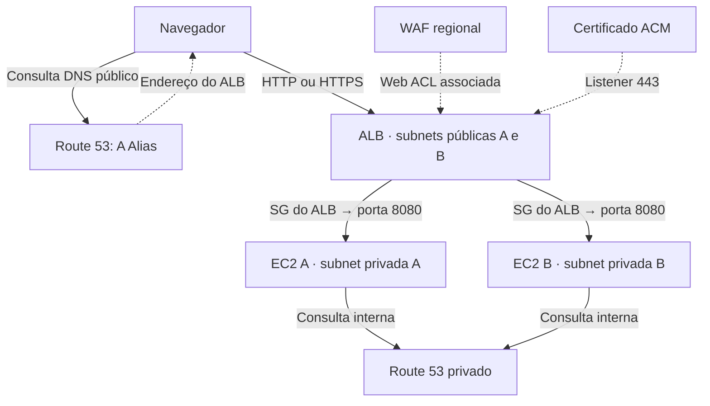

# Campus na Nuvem

**Laboratório de Redes, DNS e Segurança de Aplicações · AWS Academy · 90 minutos**

Um portal de eventos pronto para publicar em duas EC2 privadas, atrás de um Application Load Balancer. O aluno configura e observa a infraestrutura: não precisa desenvolver a aplicação nem instalar dependências nela.

**Comece pelo [tutorial do aluno](docs/TUTORIAL-ALUNO.md). Professor: leia primeiro a [preparação da turma](docs/PROFESSOR.md).**

## O que está pronto

- Portal responsivo com agenda fictícia, identificação do servidor e consulta de DNS interno.
- Seis templates CloudFormation, já gerados, cobrindo os sete serviços solicitados.
- Tutorial do console AWS, desafios, evidências, limpeza e diagnóstico de problemas.
- Roteiro para gravar um vídeo demonstrativo. Não inclui vídeo gravado.
- Testes locais e gerador dos templates para manutenção do projeto.

## Condições para executar todos os serviços

1. O laboratório precisa permitir VPC, EC2, ELBv2, Route 53, ACM, WAFv2 e CloudFormation, incluindo suas operações de criação, atualização e exclusão.
2. Para HTTPS público, é obrigatório controlar um domínio/subdomínio real e poder publicar DNS de validação. **O Academy não fornece automaticamente um domínio para este projeto.**
3. O professor prepara a delegação DNS e o certificado antes da aula de 90 minutos; os alunos inspecionam essa preparação e configuram o listener HTTPS na aula.
4. Sem domínio ou com serviço negado pelo Academy, o laboratório completo ainda não está viabilizado. É possível executar a parte permitida, mas isso não equivale a usar os sete serviços.

**Status:** código e templates com validação local documentada em [VALIDACAO.md](docs/VALIDACAO.md). A implantação no AWS Academy da turma precisa ser ensaiada pelo professor. Não foi executada nesta entrega.

## Baixar

Na primeira vez, use **git clone** (substitua a URL pelo repositório publicado pelo professor):

```bash
git clone URL_DO_REPOSITORIO campus-cloud-lab
cd campus-cloud-lab
```

Em cópia já existente, sem alterações locais pendentes:

```bash
git pull --ff-only
```

A alternativa é baixar e extrair o ZIP. Os arquivos em `infra/` já estão prontos para upload no CloudFormation. Nenhum comando de build é necessário para o aluno.

## Mapa dos serviços

| Serviço | Implementação e atividade |
|---|---|
| Amazon VPC | `01-base.yaml`: CIDR /16, quatro subnets /24, duas AZs, tabelas pública/privada, IGW e rota padrão pública. |
| Security Groups | `01-base.yaml`: entrada HTTP no ALB, saída apenas à aplicação, EC2 recebe 8080 somente do SG do ALB; sem SSH. Porta 443 adicionada pela stack HTTPS. |
| ALB | `01-base.yaml`: listener HTTP, target group, duas instâncias, health check `/health`; `05-https.yaml`: listener HTTPS. |
| Route 53 | `02-dns-privado.yaml`: zona associada à VPC e registro A para IPs privados; `03-dns-publico.yaml`: zona pública delegada; `05-https.yaml`: A Alias para ALB. |
| ACM | `04-certificado.yaml`: certificado público com validação DNS na zona pública da mesma conta. |
| WAF | `06-waf.yaml`: Web ACL regional, regra por URI, Count/Block e associação ao ALB. |
| CloudFormation | Os seis templates provisionam e removem os recursos; aluno examina parâmetros, recursos, eventos e outputs. |

## Arquitetura



DNS fornece a resolução do nome; não transporta as requisições HTTP. WAF inspeciona requisições no ALB; não é uma máquina adicional no caminho. HTTPS termina no ALB; ALB → EC2 usa HTTP dentro da VPC, protegido por SG. Este laboratório não implementa criptografia de ponta a ponta.

## Executar localmente (opcional)

Python 3.9 ou superior, sem `pip install` para executar a aplicação:

```bash
python3 app/server.py
```

Abra `http://127.0.0.1:8080`. Encerre com Ctrl+C. A consulta `app.campus.internal` deve falhar fora da VPC: é esperado.

## Estrutura

```text
app/                     Portal e servidor Python sem dependências externas
infra/01-base.yaml        VPC + SG + EC2 + ALB
infra/02-dns-privado.yaml  DNS interno
infra/03-dns-publico.yaml Zona pública delegada
infra/04-certificado.yaml Certificado ACM
infra/05-https.yaml       Listener TLS e A Alias
infra/06-waf.yaml         Web ACL e regra Count/Block
scripts/                 Geração dos templates e teste HTTP remoto
tests/                   Verificação local da aplicação e infraestrutura
docs/                    Tutorial, preparação, vídeo, fontes e validação
```

## Manutenção pelo professor

Edite `app/` ou `scripts/build_templates.py`, depois gere os templates. Os alunos não precisam fazer isso.

```bash
python3 -m pip install -r requirements-dev.txt
python3 scripts/build_templates.py
python3 -m unittest discover -s tests -v
cfn-lint infra/*.yaml
```

O gerador embute arquivos em um pacote Base64 no UserData das EC2; não baixa código em execução. A base utiliza Amazon Linux 2023 **standard x86_64**, que inclui Python 3. Se mudar o UserData de uma instância existente, não presuma que cloud-init rodará novamente: para este laboratório, recrie a stack base e as extensões dependentes.

## Limites e custos

Aplicação didática de leitura, sem autenticação, inscrições, banco ou persistência. `/admin` é fictício. O servidor Python da biblioteca padrão não é indicado para produção. Não há Auto Scaling, NAT Gateway, bastion, criação de IAM role, uso de credenciais na aplicação ou acesso SSH.

EC2, EBS, ALB, IPv4 público do ALB, hosted zones e WAF podem consumir os créditos. Desligar EC2 não apaga ALB, WAF, volumes ou zonas. Excluir as stacks ao final é parte obrigatória do exercício. Consulte [preparação e custos](docs/PROFESSOR.md).
