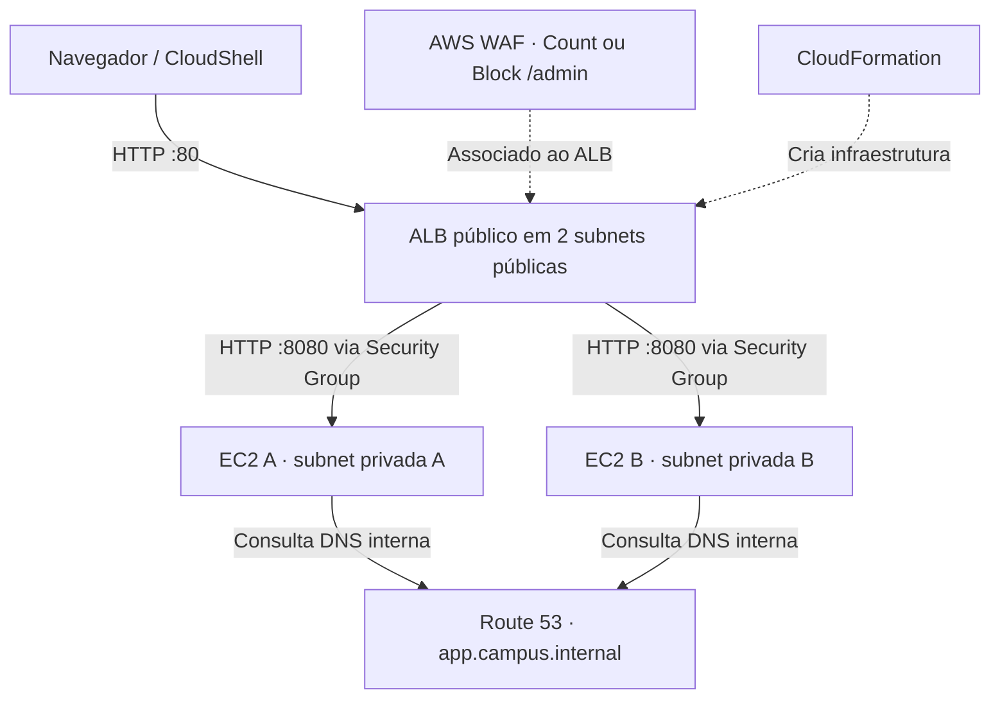

# Campus na Nuvem

**Laboratório prático de Redes, DNS, Balanceamento e Segurança na AWS — AWS Academy**

Portal de eventos fictícios implantado em **duas instâncias EC2 privadas**, por trás de um **Application Load Balancer público**, usando **CloudFormation**. O objetivo é estudar VPC, Security Groups, balanceamento, DNS privado e AWS WAF. Não é um portal de inscrições nem um projeto de produção.

## Comece aqui

**[Tutorial atualizado para alunos — do zero à limpeza](docs/TUTORIAL-ALUNO.md)**: passo a passo do console e do CloudShell para a trilha **sem domínio público**, incluindo AMI, duas AZs, parâmetros, criação das stacks, testes, falha/recuperação, DNS, WAF e resolução de erros.

**[Preparação do professor](docs/PROFESSOR.md)** · **[Checklist de evidências](docs/EVIDENCIAS.md)** · **[Resultados do ensaio](docs/VALIDACAO.md)** · [Roteiro de vídeo](docs/ROTEIRO-VIDEO.md)

### O que foi comprovado no AWS Academy

Em **08/10/2026**, durante uma execução acompanhada com resultados de CloudShell fornecidos pelo operador, foram observados:

- Pilha base criada; `/health` retornou `ok`; `/api/eventos` retornou três eventos.
- Aplicação respondeu como **Servidor A** e **Servidor B**; os dois targets ficaram `healthy`.
- Após interromper **B**, **A** continuou atendendo, embora tenha ocorrido **uma resposta HTTP 504 durante a transição**; B voltou depois ao estado `healthy`.
- Zona DNS privada criada: `app.campus.internal` resolveu para os dois endereços privados das EC2.
- AWS WAF foi criado em `Count` e atualizado para `Block`: `/admin` passou de HTTP **200** para **403** após propagação; `/` continuou HTTP **200**.
- As duas EC2 apareceram `running`, com **IP privado e sem IPv4 público**.

**Limites do ensaio:** a inspeção final de **rotas VPC e regras de Security Groups** está prevista no tutorial, mas não foi comprovada pelos resultados enviados; **DNS público, ACM e HTTPS não foram executados** porque não havia domínio controlado. Isso não equivale a validação do percurso completo em todas as contas AWS Academy. Consulte os detalhes em [VALIDACAO.md](docs/VALIDACAO.md).

## Arquitetura da trilha principal



**Rede definida nos templates:** VPC `10.0.0.0/16`; públicas `10.0.1.0/24` e `10.0.2.0/24` com Internet Gateway; privadas `10.0.11.0/24` e `10.0.12.0/24` sem rota padrão para internet. Os IPs de EC2 são **dinâmicos** e precisam ser obtidos dos Outputs de cada grupo, nunca copiados do ensaio.

## Arquivos do projeto

| Arquivo | Papel |
|---|---|
| `app/` | HTML, CSS, JavaScript e servidor Python sem dependências externas |
| `infra/01-base.yaml` | VPC, subnets, IGW, tabelas de rotas, Security Groups, duas EC2 e ALB HTTP |
| `infra/02-dns-privado.yaml` | Zona Route 53 privada e registro A para as EC2 |
| `infra/06-waf.yaml` | Web ACL, regra `AdminDemo` Count/Block e associação ao ALB |
| `infra/03-dns-publico.yaml`, `04-certificado.yaml`, `05-https.yaml` | **Etapa opcional, não executada no ensaio:** somente com domínio público controlado, permissões e certificado válido |
| `docs/TUTORIAL-ALUNO.md` | Roteiro reproduzível completo |
| `docs/EVIDENCIAS.md` | Modelo de avaliação e documentação |
| `docs/PROFESSOR.md` | Pré-aula, restrições, cronograma e custo |
| `docs/VALIDACAO.md` | O que foi observado na AWS e o que ainda falta testar |
| `scripts/` e `tests/` | Gerador de templates, smoke test e validações locais |

## Para obter os arquivos

```bash
git clone https://github.com/Irandisilvaa/campus-cloud-lab.git
cd campus-cloud-lab
```

Em uma cópia existente (sem alterações pendentes):

```bash
git pull --ff-only
```

Alternativamente, use **Code → Download ZIP** no GitHub. O aluno não precisa executar geradores: os seis templates em `infra/` já estão incluídos. Pelo CloudShell, o tutorial também ensina a baixar apenas o YAML necessário via `curl`.

## O que ensinar antes da prática

- **EC2** executa a aplicação; **VPC** isola e organiza a rede; **subnets/route tables/IGW** definem caminhos.
- **Security Groups** autorizam conexões por porta/origem; **ALB** distribui requisições entre EC2 e verifica a saúde de `/health`.
- **Route 53 privado** resolve um nome dentro da VPC, e **WAF** inspeciona o caminho HTTP `/admin` para demonstrar Count e Block.
- **CloudFormation** descreve e provisiona a infraestrutura como código (IaC), mas precisa das mesmas permissões do ambiente.
- **ACM/HTTPS** exigem controle de domínio público para esta implementação; não são parte obrigatória da trilha validada sem domínio.

Não há Auto Scaling, SSH, NAT ou criptografia entre ALB e EC2. O WAF demonstrado não fornece proteção completa de produção.

## Manutenção e testes locais

```bash
python3 -m pip install -r requirements-dev.txt
python3 scripts/build_templates.py
python3 -m unittest discover -s tests -v
cfn-lint infra/*.yaml
node --check app/app.js
```

**Atenção:** regenerar `01-base.yaml` altera o UserData embutido; um `git pull` no CloudShell não atualiza instâncias já criadas. Em laboratório, faça uma nova implantação controlada. Não coloque chaves AWS no repositório.

## Custos e limpeza

EC2, EBS, ALB, IPv4 do balanceador, Route 53 e WAF podem consumir créditos. Use **somente os recursos permitidos na conta do seu grupo**. Exclua, nessa ordem, as stacks **WAF → DNS privado → Base** quando não tiver HTTPS público. O encerramento da sessão do Academy não garante exclusão de recursos. O tutorial inclui comandos de verificação e limpeza.
